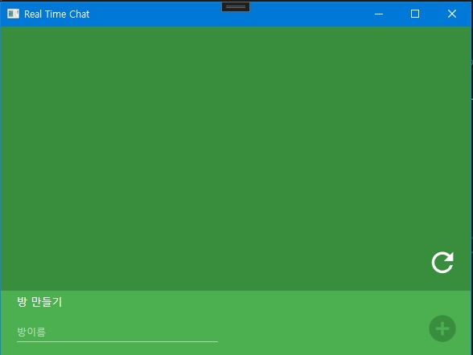
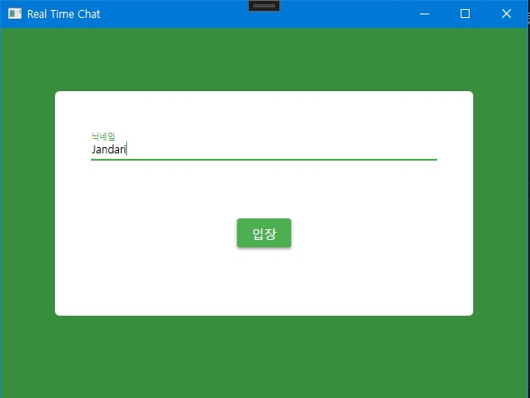
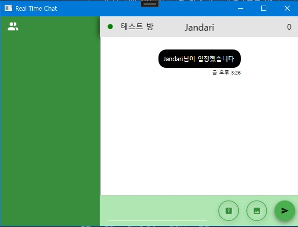
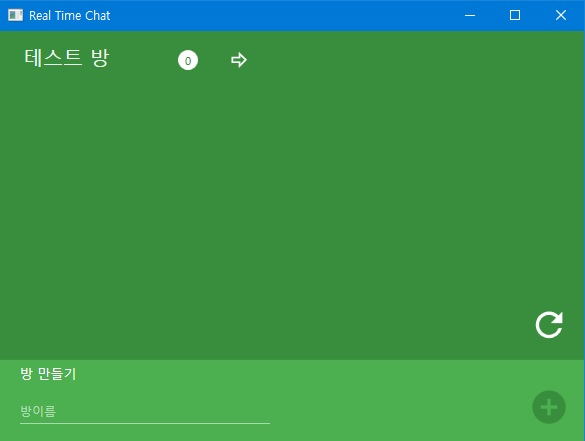
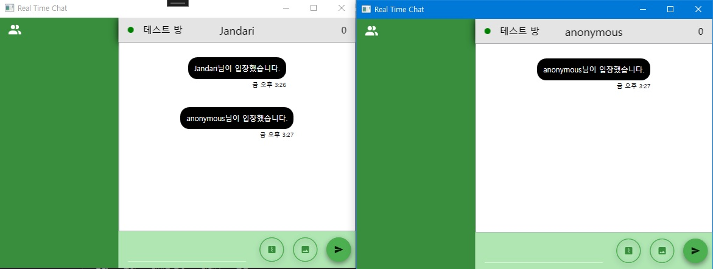
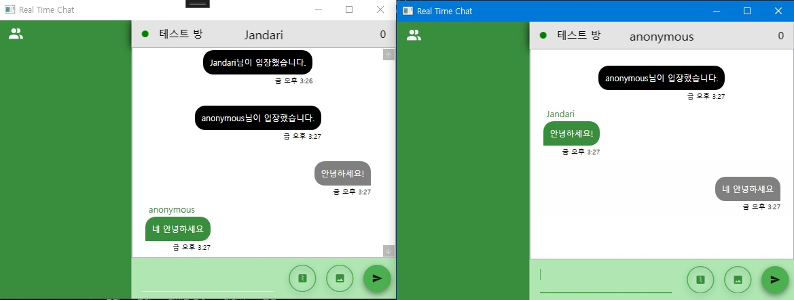
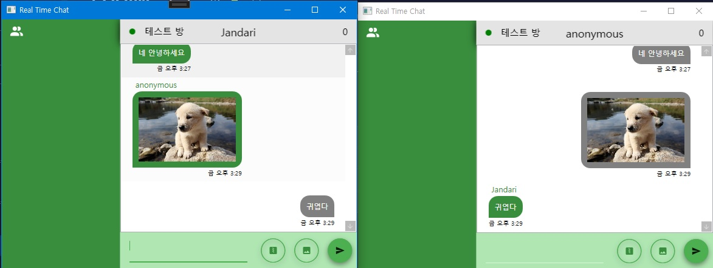

# Volatility-Chat
RabbitMQ API를 활용한 휘발성 채팅 프로그램

## 개요

RabbitMQ API 스터디를 위해 개인 프로젝트를 만들었습니다.  
오직 RabbitMQ만 사용한 Database가 없이 실시간으로 채팅방이 만들어지고 사라지는 휘발성 채팅 프로그램입니다.  

또한 자동 업데이트가 되도록 Squirrel를 사용하여 백그라운드 업데이트가 가능하도록 제작하였습니다.

## 사용 언어 및 개발 환경

* C#
* WPF
* RabbitMQ
* Akka.NET
* Squirrel

## 특징

## UI

### 방만들기

### 입장

### 채팅

